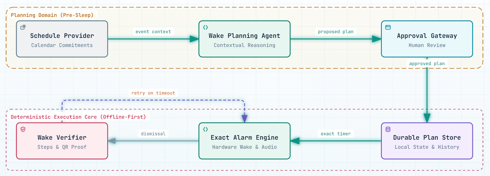

# Wake Me Up

<p align="center">
  
</p>

<p align="center">
  
  
  
  
  
</p>

**Wake Me Up** is an Android alarm app that turns an upcoming calendar commitment into a user-approved wake plan. An AI agent proposes the timing; Android owns exact alarm delivery, physical wake verification, retries, and local persistence.

> AI is used for planning. The alarm and verification flow remains deterministic and works without the agent server once a plan has been approved.

## What it does

- Reads upcoming Android calendar occurrences.
- Generates a structured wake plan from calendar context, preparation time, travel time, safety margin, and recent wake outcomes.
- Validates every generated plan before it can be approved or scheduled; unsafe model output falls back to deterministic safe timing.
- Lets the user approve, reject, or adjust a proposed plan. A time stated in an adjustment, such as `6am`, is applied as the requested first-alarm time when it is safe.
- Lets the user create a one-time alarm directly with the native Android time picker.
- Schedules approved alarms with `AlarmManager.setAlarmClock()`.
- Shows a full-screen native alarm, then starts a foreground verification service after dismissal.
- Verifies waking through the Android step counter or a configured QR code using the system barcode scanner.
- Persists wake plans, outcomes, plan feedback, and pending Telegram escalations in Room.
- Retries a missed planned wake alarm. One-time manual alarms use a short, single verification window for quick testing.
- Shows readiness information for battery, charging, calendar access, step-sensor availability, exact-alarm access, and full-screen alarm access.
- Provides Home, Recent, Alarms, and Settings screens.
- Optionally queues a Telegram escalation when the final verification attempt fails. Pending alerts are retained locally until the app can attempt delivery.

## Architecture

<p align="center">
  
</p>

```text
Android Calendar
      │
      ▼
React Native app ──► Wake planning server ──► OpenRouter model
      │                     │
      │                     └── CopilotKit runtime
      ▼
Room database ──► AlarmManager exact alarm ──► Full-screen alarm
                                                    │
                                                    ▼
                                  Foreground verification service
                                  ├── Step counter
                                  ├── QR scan
                                  └── Retry / queued Telegram escalation
```

The planning path is online. After approval, Android performs alarm scheduling, ringing, verification, retries, and persistence locally.

## Stack

| Area | Implementation |
| --- | --- |
| Mobile app | React Native 0.87, React 19, TypeScript |
| Native runtime | Kotlin, Android `AlarmManager`, foreground service, `TYPE_STEP_COUNTER` |
| Local data | Room |
| Calendar | Android `CalendarContract.Instances` |
| QR verification | Google Play services Code Scanner (ML Kit) |
| Agent runtime | CopilotKit React Native provider and CopilotKit Express runtime |
| Planning model | OpenRouter through the OpenAI-compatible SDK; direct OpenAI is also supported by configuration |
| Server | Express, TypeScript, `tsx` |
| Tests and tooling | Jest, Node test runner, Biome, TypeScript |

## Requirements

- Node.js 22.11 or later
- pnpm
- Android SDK, an Android emulator, or a physical Android device
- An Android calendar account with events, for calendar-based planning
- An OpenRouter API key for agent planning

## Setup

Install dependencies and create the local server configuration:

```bash
pnpm install
cp .env.example .env
```

Configure `.env`:

```dotenv
# Required for OpenRouter planning
OPENROUTER_API_KEY=your_openrouter_api_key
OPENROUTER_MODEL=openai/gpt-4o-mini

# Local agent server
PORT=3000

# Optional: trusted-contact escalation
TELEGRAM_BOT_TOKEN=
TELEGRAM_CHAT_ID=
```

`OPENAI_API_KEY` and `OPENAI_MODEL` are supported as an alternative provider configuration. Do not commit `.env` or expose its values in screenshots, logs, or source control.

Start Metro and the planning server:

```bash
pnpm dev
```

In a second terminal, build and install the Android app:

```bash
pnpm android
```

The `predev` script reverses ports `8081` and `3000` through ADB, so a debug build on a connected device reaches Metro and the local agent server through `localhost`.

When the app opens, grant the requested Calendar, Activity Recognition, and notification permissions. Before scheduling, Android may also require **Alarms & reminders** and **full-screen notification** access. The app opens the relevant system setting when either access is unavailable.

Any change under `android/` is native code and requires another `pnpm android` install. React Native-only changes can be refreshed from Metro.

## App flow

### Calendar wake plan

1. Open Home and select an upcoming calendar commitment.
2. The server generates a wake-plan draft.
3. Review the event, alarm time, wake objective, step target, and QR fallback.
4. Approve to save it in Room and schedule the Android alarm; reject to close it, or adjust it and request a revised plan.

### One-time alarm

1. Tap `+`.
2. Select a time in the native picker and optionally name the alarm.
3. Set the alarm. A selected time that has already passed is scheduled for the next day.

### Verification and escalation

1. The exact alarm opens the full-screen alarm activity.
2. Dismissing it begins foreground step verification.
3. Reach the required step count, or scan the configured QR value, to verify the wake objective.
4. On timeout, planned wake plans may retry according to their configured retry limit. A final failure is written to history.
5. If Telegram escalation is enabled, the final failure is written to the local pending-escalation queue and sent through the server when the app can make the request.

## Settings and local data

Settings stored on the device:

- Preparation, travel, and safety-margin minutes used for agent planning.
- The expected bathroom QR value.
- Telegram escalation on/off.

Room stores:

- Wake plans and their scheduling state.
- Wake outcomes, including attempts, observed steps, verification method, and success.
- Approval, rejection, and adjustment feedback.
- Pending Telegram escalations.

Alarms that remain scheduled after a reboot are re-scheduled by the boot receiver.

## Server routes

| Route | Purpose |
| --- | --- |
| `GET /api/health` | Reports server, agent-provider, and Telegram configuration status. |
| `POST /api/plan/generate` | Generates and validates a structured wake plan from calendar context. |
| `POST /api/chat` | Sends a contextual message to the wake-planning agent. |
| `POST /api/telegram/escalate` | Sends a queued trusted-contact Telegram alert. |
| `/api/copilotkit` | CopilotKit runtime endpoint. |

## Project structure

```text
App.tsx                                  Main React Native application and screens
src/
  adjustment.ts                          Requested alarm-time parsing
  manualAlarm.ts                         One-time alarm plan creation
  api/agentClient.ts                     Planning and Telegram server client
  components/                            Calendar, plan, readiness, and verification UI
  native/WakeMeUpBridge.ts               TypeScript interface to the native module
server/
  src/agent.ts                           OpenRouter/OpenAI wake-plan generation
  src/server.ts                          Express and CopilotKit runtime server
  src/wakePlan.ts                        Plan schema validation and safe timing
android/app/src/main/java/com/wakemeup/
  alarm/                                 Exact scheduling, receiver, full-screen alarm, boot restore
  bridge/                                React Native native module and events
  calendar/                              CalendarContract reader
  db/                                    Room entities, DAOs, and database
  verification/                          Step tracking and foreground verification service
assets/branding/                         Application logo and favicon
public/architecture.png                  Architecture diagram
__tests__/                               React Native and utility tests
```

## Commands

| Command | Purpose |
| --- | --- |
| `pnpm dev` | Start Metro and the local planning server. |
| `pnpm agent` | Start only the local planning server. |
| `pnpm android` | Build and install the Android debug app. |
| `pnpm reverse` | Reverse Metro and agent-server ports through ADB. |
| `pnpm test` | Run React Native and utility tests. |
| `pnpm typecheck` | Type-check the mobile app. |
| `pnpm lint` | Run Biome checks for the app source. |
| `pnpm format` | Format app source with Biome. |
| `pnpm --dir server test` | Run server wake-plan tests. |
| `pnpm --dir server typecheck` | Type-check the server. |
| `cd android && ./gradlew :app:assembleDebug` | Build the Android debug APK without installing it. |

## Android permissions used

| Permission or capability | Used for |
| --- | --- |
| Calendar read | Reading upcoming commitments. |
| Exact alarms | Scheduling wake alarms at their approved time. |
| Full-screen intent | Displaying the alarm over the lock screen. |
| Activity recognition | Reading the step-counter sensor. |
| Foreground service and health type | Running time-bounded wake verification. |
| Notifications and vibration | Alarm and verification notifications. |
| Boot completed | Restoring future scheduled alarms after reboot. |
| Internet | Agent planning and optional Telegram delivery. |
